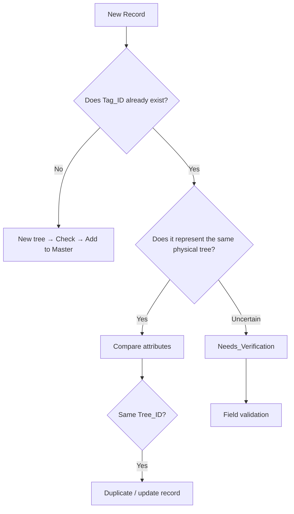
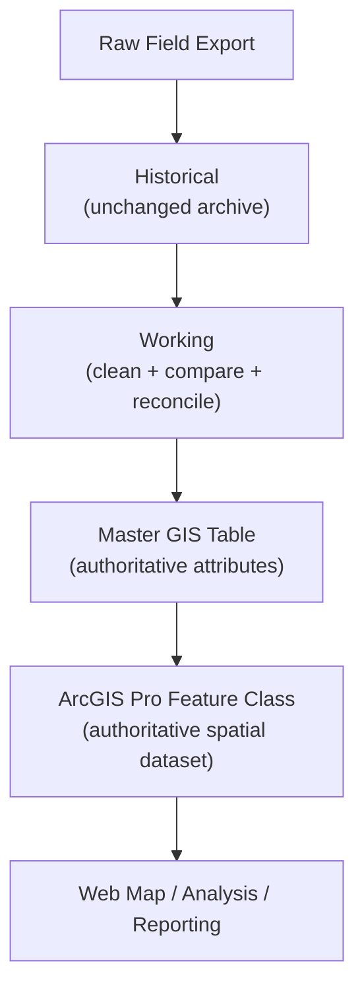

# Data Integration Checklist

**Campus Tree Inventory GIS Project**

## Purpose

Use this checklist whenever a new field collection is incorporated into the Master dataset. Every incoming record must be matched, reconciled (comparing an incoming record against the existing Master dataset), flagged for verification, or intentionally excluded before it reaches the authoritative GIS layer (mastersheet **ADD REAL NAME HERE**) -- nothing gets in unaccounted for.

This is the practical step-by-step companion to [`gis/database_development_workflow.md`](./database_development_workflow.md)'s Section 2 (Data Staging) and Section 3 (Data Reconciliation) -- that document explains the *why* of the pipeline; this one (`data_integration_checklist.md`) is what you actually check off while doing it.

> **Core rule:** Do not delete questionable records simply because they conflict. Preserve the evidence in Historical or Working (preferably both; History if you are having trouble choosing), and only place the resolved record in Master GIS (**ADD MASTER SHEET**).

---

## 1. Prepare the Incoming Data

**Before comparison:**

- [ ] Preserve the original field-day export in Historical
- [ ] Copy the new records into Working
- [ ] Match the Master GIS field names exactly
- [ ] Confirm `Tree_ID` formatting matches whatever convention is actually resolved (see the flagged note above)
- [ ] Confirm `Tag_ID` formatting
- [ ] Confirm latitude/longitude are numeric
- [ ] Confirm DBH and measurement fields contain numbers only
- [ ] Confirm dates/times are valid
- [ ] Do not overwrite the existing Master GIS dataset yet

---

## 2. Check for Duplicate Tree_IDs

Sort `Tree_ID` smallest to largest. Look for any ID appearing more than once, or unexpected formatting differences between rows that should match.

**Excel helper** (if `Tree_ID` is in column A):
```
=COUNTIF($A:$A,A2)
```

| Result | Meaning |
|---|---|
| 1 | `Tree_ID` occurs once |
| 2+ | `Tree_ID` requires review |

**Important:** a repeated `Tree_ID` is not automatically a duplicate -- continue to Step 3 before concluding anything.

---

## 3. Compare Tag_ID

<details>
<summary><strong>Why both Tag_ID and Tree_ID get checked, not just one</strong></summary>
</details>

`Tag_ID` is the primary field-level reference for determining whether two records **may** represent the same physical tree -- a starting signal, not a final answer.

**Excel helper** (if `Tag_ID` is in column B):
```
=COUNTIF($B:$B,B2)
```
Flag any result greater than 1.

---

## 4. Apply the Duplicate/Conflict Logic

**Case A — Same `Tree_ID` + Same `Tag_ID`**
Two records with identical or essentially identical information.

- [ ] Confirm records represent the same tree
- [ ] Keep the appropriate authoritative record
- [ ] Preserve the original record in Historical
- [ ] Remove the redundant record from the Working copy
- [ ] Do not create two GIS points

*Classification: Duplicate survey record.*

**Case B — Same `Tag_ID` + Different `Tree_ID`**
The trickier case -- the same physical tag showing up under two different database identities.

- [ ] Compare species
- [ ] Compare coordinates
- [ ] Compare photographs
- [ ] Compare dates
- [ ] Compare field notes
- [ ] Determine whether the records could represent the same physical tree
- [ ] If unresolved → `Needs_Verification`, flag for in-situ field validation

**Never resolve a species conflict by guessing.**

<details>
<summary><strong>How this relates to the automated `Duplicate_Candidate` status</strong></summary>

Case A above and the `Duplicate_Candidate` status (`SCHEMA.md`, `point_validation_toolkit.py`) are two different mechanisms, not competing ones. Case A is a **manual, confirmed** duplicate a human has already resolved during reconciliation -- by the time it's handled here, it's cleaned up directly, no `Status` flag needed going forward. `Duplicate_Candidate` is for the **automated, tentative** case -- the validation script flagging two points that are merely *close enough* to maybe be the same tree, without a human having confirmed anything yet. One is "we know, it's fixed." The other is "we're not sure, go check."

</details>

---

## 5. Check Species Conflicts

If the same `Tag_ID` has different species recorded:

- [ ] Do **not** automatically overwrite either species
- [ ] Mark `Needs_Verification`
- [ ] Add a note describing the conflict
- [ ] Add the tree to the field-validation list

*Example note format: "Tag_ID 1 -- Tree_ID 0001. Species conflict between historical and April observation. Field verification required."*

---

## 6. Check Coordinate Conflicts

For preliminary Excel screening, flag records where coordinates differ substantially, the point falls outside the expected campus area, the point falls in a building/road/impossible location, or `GPS_Accuracy_m` is high. Use GIS for the final spatial comparison once you have both records' coordinates.

**GPS status logic** *(same tiers as `SCHEMA.md` -- kept here at-a-glance for active reconciliation work, not a second independent definition of them)*:

| GPS Accuracy | Working Classification |
|---|---|
| ≤3 m | Spatially verified/acceptable |
| >3–5 m | Conditional / review |
| >5 m | Uncertain location |

These thresholds are project acceptance criteria, not a claim that the GPS measurement itself has centimeter-level accuracy.

---

## 7. Identify New Trees

If a `Tag_ID` does not exist in the existing Master dataset:

- [ ] Confirm it is genuinely a new tree
- [ ] Assign appropriate `Tree_ID`
- [ ] Assign `New_2025` *(see flag below — confirm this is still the correct value to use)*
- [ ] Check coordinates
- [ ] Check species
- [ ] Check for accidental duplicate tags

> **⚠️ Flagged again, now for the third time in this repo's docs:** this checklist's original wording said *"Assign `New_2025` or the appropriate project-year status"* — which reads as an expectation that a `New_2026`, `New_2027`, etc. will eventually be needed. But `SCHEMA.md` currently defines `New_2025` as a fixed label meaning "new since the 2022 baseline," not a per-year rotating value. Three separate documents have now brushed up against this same ambiguity without it ever being explicitly settled. Worth actually deciding one way or the other before a tree gets logged as `New_2025` in, say, November 2026.

---

## 8. Identify Missing/Removed Trees

If a previously inventoried tree is not found during a new field collection, **do not automatically delete it.**

- [ ] Confirm the survey team actually covered the location
- [ ] Check imagery
- [ ] Check field notes
- [ ] Check whether the tree was removed
- [ ] If confirmed absent → `Removed`
- [ ] If uncertain → `Needs_Verification`

`Removed` is a field-confirmed state only — see `protocols/point_validation_SOP.md` Section 6 for why a desk check alone can never assign it.

---

## 9. Apply Status

Every record should have a status that tells the next person what needs to happen next -- status should drive the next action, not just describe the record.

| Status | Action |
|---|---|
| `Existing` | Verified tree |
| `Needs_Verification` | Identity/existence requires field review |
| `Missing_Tag` | Tree exists but tag requires attention |
| `New_2025` | Newly identified tree |
| `Uncertain_Location` | Spatial position requires correction |
| `Removed` | Confirmed no longer present |
| `Duplicate_Candidate` | Automated flag from `point_validation_toolkit.py` -- human review required, never auto-deleted (not typically assigned during this manual checklist -- see Section 4's note above) |

---

## 10. Check for Empty / Invalid Values

Before GIS import:

- [ ] No blank `Tree_ID` for known trees
- [ ] No duplicate authoritative `Tree_ID`
- [ ] `Tag_ID` checked
- [ ] Species standardized
- [ ] DBH numeric
- [ ] Latitude numeric
- [ ] Longitude numeric
- [ ] GPS accuracy numeric
- [ ] Dates valid
- [ ] No accidental text in numeric fields

**Useful Excel tests** -- numeric field check: `=IF(ISNUMBER(G2),"OK","CHECK")` · blank detection: `=IF(G2="","MISSING","OK")` (swap `G2` for the relevant cell).

---

## 11. Final Working-Sheet QA

Before moving records to Master GIS:

- [ ] Duplicate `Tree_ID` review complete
- [ ] Duplicate `Tag_ID` review complete
- [ ] Species conflicts identified
- [ ] Coordinate conflicts identified
- [ ] New trees identified
- [ ] Removed trees investigated
- [ ] Status assigned
- [ ] GPS accuracy reviewed
- [ ] Required attributes checked
- [ ] No unresolved duplicates accidentally entered into Master GIS

---

## 12. Update Master GIS

**Only after reconciliation, Master GIS should contain: one authoritative record per physical tree, correct `Tree_ID`, correct `Tag_ID` where known, best available coordinates, current attributes, appropriate `Status`, and documentation of any unresolved uncertainty.**

**Do not:** delete historical evidence · guess conflicting species · move questionable GPS points without documentation · treat high-accuracy claims as field verification · overwrite the authoritative GIS layer without preserving the previous version.

---

## 13. ArcGIS Pro Validation

After updating the Master GIS feature class -- this overlaps with `gis/arcgis_pro_workflow.md` Section 11 (Quality Control); same checks, this is the moment in the pipeline they actually happen:

- [ ] Load the updated feature class into ArcGIS Pro
- [ ] Confirm all expected points appear
- [ ] Check for points outside the campus boundary
- [ ] Check obvious spatial outliers
- [ ] Symbolize by `Status`
- [ ] Compare against aerial imagery
- [ ] Review high-uncertainty areas
- [ ] Confirm the number of GIS records matches the reconciled Master dataset

---

## 14. Final Reconciliation Record

Before declaring the update complete, record:

```
Field Collection Date:
Source File:
Records Received:
Records Added:
Records Matched:
Duplicates Removed:
Conflicts Flagged:
Trees Marked Uncertain_Location:
Trees Marked Removed:
GIS Records After Update:
Date Integrated:
Reviewed By:
```

This is the audit trail nothing else in this repo currently produces, and it serves as evidence `point_validation_SOP.md`'s stated purpose (*"defensible when someone asks 'how do you know these points are accurate?'"*) depends on. Worth keeping one of these per field collection, maybe archived alongside the corresponding Historical-tier export.

---

## Decision Tree



## Golden Rules

- `Tag_ID` helps identify the physical tree; `Tree_ID` provides the project's persistent record identity.
- Same `Tag_ID` + different species = investigate, never guess.
- Same `Tree_ID` + same `Tag_ID` + identical survey = duplicate candidate.
- A missing tree is not automatically a `Removed` tree.
- Poor GPS does not mean the tree is wrong; it means the location needs review.
- Preserve raw evidence; clean the working dataset; maintain one authoritative GIS record.
- Every unresolved problem should have a `Status` that tells the next person what to do.
- GIS validation is the final spatial QA/QC step before the dataset is treated as authoritative.

## Recommended File Flow



This is the same pipeline `overview.md` is currently missing an explicit deliverable for (the "GIS system established" gap flagged a couple messages back) — this diagram is a ready-made answer if you want to reuse it there instead of, or alongside, the table row we drafted.
(REMOVE THIS PARAGRAPH AFTER RESOLVED)